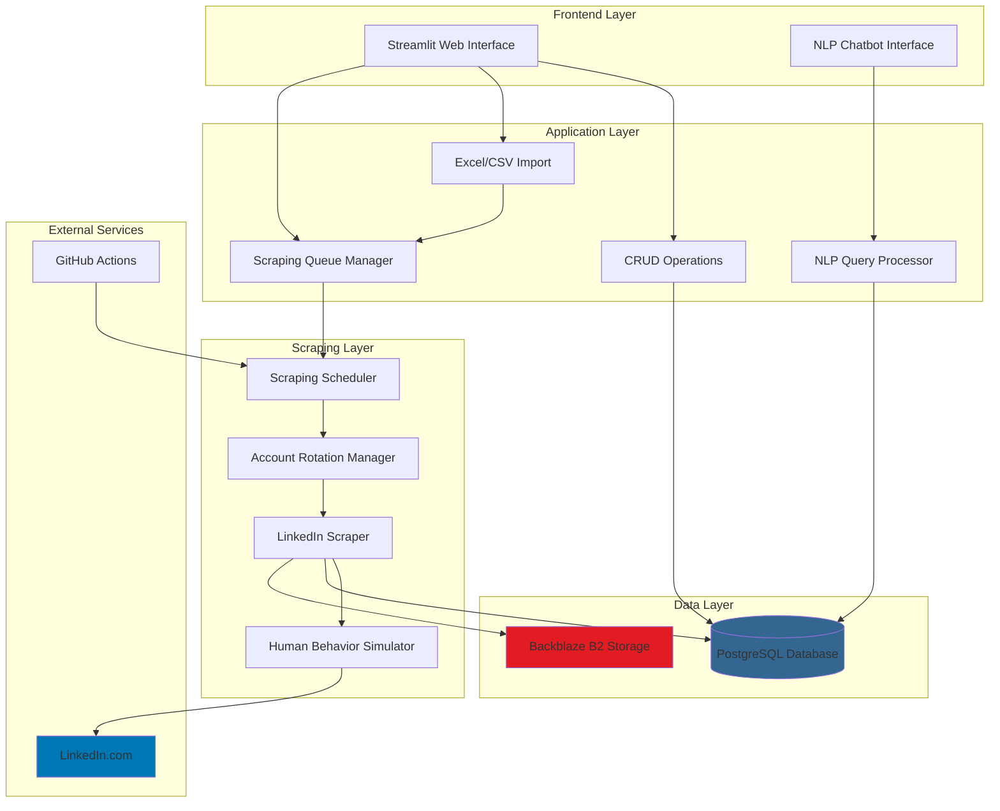

# Design Document

## Overview

The Alumni Management System is a Python-based application that automates the collection, storage, and querying of alumni career data from LinkedIn. The system architecture follows a modular design with clear separation of concerns across five main components: scraping, database, storage, frontend, and chatbot.

The system addresses the challenge of maintaining current alumni data at scale by automating LinkedIn profile scraping with intelligent rate limiting and multi-account rotation. It provides both a user-friendly web interface for browsing and filtering alumni records, and a natural language chatbot interface for conversational queries.

Key design principles:
- **Modularity**: Each component (scraper, database, storage, frontend, chatbot) is independently testable and replaceable
- **Resilience**: Failures in one component do not cascade to others; graceful degradation is preferred
- **Scalability**: Multi-account rotation and queue-based processing support large-scale scraping operations
- **Security**: All credentials are externalized to environment variables; no secrets in code
- **Human-like behavior**: Scraping includes randomization and behavioral patterns to avoid detection

## Architecture

### System Architecture Diagram



### Component Interaction Flow

**Bulk Import and Scraping Flow:**
1. Administrator uploads Excel/CSV file to Web Interface
2. Import module parses file and creates/updates alumni records in database
3. Import module adds profiles to scraping queue
4. Administrator clicks "Start Scraping" button
5. Scraping Scheduler pulls profiles from queue
6. Account Rotation Manager selects next available account
7. LinkedIn Scraper authenticates and navigates to profile
8. Human Behavior Simulator adds randomization to actions
9. Scraper extracts data and generates PDF
10. Data is saved to database, PDF uploaded to B2
11. Process repeats for next profile in queue

**Query Flow:**
1. User enters natural language query in chatbot
2. NLP Query Processor parses intent and entities
3. Processor generates SQL query
4. Database returns matching alumni records
5. Results formatted and displayed to user

## Components and Interfaces

### 1. LinkedIn Scraper Component

**Purpose**: Automate extraction of profile data from LinkedIn with anti-detection measures

**Key Classes**:
- `LinkedInScraper`: Main scraper class managing browser automation
- `AccountRotationManager`: Manages multiple LinkedIn accounts and usage tracking
- `HumanBehaviorSimulator`: Adds randomization to simulate human browsing
- `ScraperConfig`: Configuration management for delays, limits, and credentials

**Public Interface**:
```python
class LinkedInScraper:
    async def __aenter__(self) -> 'LinkedInScraper'
    async def __aexit__(self, exc_type, exc_val, exc_tb) -> None
    async def login(self, account: LinkedInAccount) -> bool
    async def scrape_profile(self, linkedin_url: str) -> Optional[ProfileData]
    async def download_profile_pdf(self, linkedin_url: str) -> Optional[bytes]
    
class AccountRotationManager:
    def __init__(self, accounts: List[LinkedInAccount], daily_limit: int)
    def get_next_account(self) -> Optional[LinkedInAccount]
    def mark_account_exhausted(self, account_id: str) -> None
    def mark_account_flagged(self, account_id: str) -> None
    def reset_daily_counters(self) -> None
    def get_usage_stats(self) -> Dict[str, int]
    
class HumanBehaviorSimulator:
    async def random_delay(self, min_sec: float, max_sec: float) -> None
    async def random_scroll(self, page: Page) -> None
    async def random_mouse_movement(self, page: Page) -> None
    async def visit_random_page(self, page: Page) -> None
```

**Dependencies**:
- Playwright for browser automation
- PostgreSQL database for usage tracking
- Configuration from environment variables

**Data Structures**:
```python
@dataclass
class LinkedInAccount:
    id: str
    email: str
    password: str
    profiles_scraped_today: int
    is_flagged: bool
    last_used: datetime

@dataclass
class ProfileData:
    linkedin_url: str
    name: str
    headline: str
    location: str
    current_company: Optional[str]
    current_designation: Optional[str]
    job_history: List[JobEntry]
    education_history: List[EducationEntry]
    contact_info: ContactInfo
    scraped_at: datetime
```

### 2. Database Component

**Purpose**: Provide structured storage and efficient querying of alumni data

**Key Modules**:
- `models.py`: SQLAlchemy ORM models
- `connection.py`: Database connection management
- `crud.py`: Create, Read, Update, Delete operations
- `init_db.py`: Database initialization and migration

**Database Schema**:

```sql
-- Alumni table (main entity)
CREATE TABLE alumni (
    id SERIAL PRIMARY KEY,
    serial_number INTEGER,
    batch VARCHAR(50),
    roll_number VARCHAR(50) UNIQUE NOT NULL,
    name VARCHAR(255) NOT NULL,
    gender VARCHAR(20),
    
    -- Contact information
    whatsapp_number VARCHAR(20),
    mobile_number VARCHAR(20),
    college_email VARCHAR(255),
    personal_email VARCHAR(255),
    corporate_email VARCHAR(255),
    
    -- LinkedIn information
    linkedin_id VARCHAR(255) UNIQUE,
    linkedin_url VARCHAR(500),
    linkedin_pdf_url VARCHAR(500),
    
    -- Current position
    current_company VARCHAR(255),
    current_designation VARCHAR(255),
    location VARCHAR(255),
    
    -- Additional information
    por TEXT,
    internship TEXT,
    higher_studies TEXT,
    closest_city VARCHAR(255),
    notable_alma_mater TEXT,
    step_programme VARCHAR(255),
    remarks TEXT,
    address TEXT,
    annual_parental_income VARCHAR(100),
    
    -- Metadata
    created_at TIMESTAMP DEFAULT CURRENT_TIMESTAMP,
    updated_at TIMESTAMP DEFAULT CURRENT_TIMESTAMP,
    last_scraped_at TIMESTAMP,
    
    INDEX idx_batch (batch),
    INDEX idx_roll_number (roll_number),
    INDEX idx_name (name),
    INDEX idx_linkedin_id (linkedin_id),
    INDEX idx_current_company (current_company),
    INDEX idx_current_designation (current_designation)
);

-- Job history table (one-to-many with alumni)
CREATE TABLE job_history (
    id SERIAL PRIMARY KEY,
    alumni_id INTEGER NOT NULL REFERENCES alumni(id) ON DELETE CASCADE,
    
    company_name VARCHAR(255) NOT NULL,
    designation VARCHAR(255),
    location VARCHAR(255),
    start_date TIMESTAMP,
    end_date TIMESTAMP,
    is_current BOOLEAN DEFAULT FALSE,
    description TEXT,
    employment_type VARCHAR(50),
    
    created_at TIMESTAMP DEFAULT CURRENT_TIMESTAMP,
    updated_at TIMESTAMP DEFAULT CURRENT_TIMESTAMP,
    
    INDEX idx_alumni_id (alumni_id),
    INDEX idx_company_name (company_name)
);

-- Education history table (one-to-many with alumni)
CREATE TABLE education_history (
    id SERIAL PRIMARY KEY,
    alumni_id INTEGER NOT NULL REFERENCES alumni(id) ON DELETE CASCADE,
    
    institution_name VARCHAR(255) NOT NULL,
    degree VARCHAR(255),
    field_of_study VARCHAR(255),
    start_year INTEGER,
    end_year INTEGER,
    grade VARCHAR(50),
    activities TEXT,
    description TEXT,
    
    created_at TIMESTAMP DEFAULT CURRENT_TIMESTAMP,
    updated_at TIMESTAMP DEFAULT CURRENT_TIMESTAMP,
    
    INDEX idx_alumni_id (alumni_id),
    INDEX idx_institution_name (institution_name)
);

-- Scraping logs table (audit trail)
CREATE TABLE scraping_logs (
    id SERIAL PRIMARY KEY,
    alumni_id INTEGER REFERENCES alumni(id),
    linkedin_url VARCHAR(500),
    account_email VARCHAR(255),
    status VARCHAR(50) NOT NULL,
    error_message TEXT,
    pdf_stored BOOLEAN DEFAULT FALSE,
    duration_seconds INTEGER,
    created_at TIMESTAMP DEFAULT CURRENT_TIMESTAMP
);

-- Account usage tracking table (for rate limiting)
CREATE TABLE account_usage (
    id SERIAL PRIMARY KEY,
    account_email VARCHAR(255) NOT NULL,
    date DATE NOT NULL,
    profiles_scraped INTEGER DEFAULT 0,
    is_flagged BOOLEAN DEFAULT FALSE,
    created_at TIMESTAMP DEFAULT CURRENT_TIMESTAMP,
    updated_at TIMESTAMP DEFAULT CURRENT_TIMESTAMP,
    
    UNIQUE(account_email, date)
);

-- Scraping queue table (for managing scraping tasks)
CREATE TABLE scraping_queue (
    id SERIAL PRIMARY KEY,
    alumni_id INTEGER NOT NULL REFERENCES alumni(id) ON DELETE CASCADE,
    priority INTEGER DEFAULT 0,
    status VARCHAR(50) DEFAULT 'pending',
    attempts INTEGER DEFAULT 0,
    last_attempt_at TIMESTAMP,
    created_at TIMESTAMP DEFAULT CURRENT_TIMESTAMP,
    
    INDEX idx_status (status),
    INDEX idx_priority (priority)
);
```

**Public Interface**:
```python
# CRUD operations
def create_alumni(db: Session, **kwargs) -> Alumni
def get_alumni_by_id(db: Session, alumni_id: int) -> Optional[Alumni]
def get_alumni_by_roll_number(db: Session, roll_number: str) -> Optional[Alumni]
def get_all_alumni(db: Session, skip: int = 0, limit: int = 100, **filters) -> List[Alumni]
def update_alumni(db: Session, alumni_id: int, **kwargs) -> Alumni
def delete_alumni(db: Session, alumni_id: int) -> bool
def search_alumni(db: Session, query: str, limit: int = 100) -> List[Alumni]

# Job history operations
def create_job_history(db: Session, alumni_id: int, **kwargs) -> JobHistory
def get_job_history_by_alumni(db: Session, alumni_id: int) -> List[JobHistory]

# Education history operations
def create_education_history(db: Session, alumni_id: int, **kwargs) -> EducationHistory
def get_education_history_by_alumni(db: Session, alumni_id: int) -> List[EducationHistory]

# Scraping queue operations
def add_to_scraping_queue(db: Session, alumni_id: int, priority: int = 0) -> ScrapingQueue
def get_next_from_queue(db: Session) -> Optional[ScrapingQueue]
def mark_queue_item_complete(db: Session, queue_id: int) -> None
def mark_queue_item_failed(db: Session, queue_id: int) -> None

# Account usage operations
def get_account_usage(db: Session, account_email: str, date: date) -> int
def increment_account_usage(db: Session, account_email: str) -> None
def reset_daily_usage(db: Session) -> None

# Utility operations
def get_unique_batches(db: Session) -> List[str]
def get_unique_companies(db: Session) -> List[str]
def get_unique_locations(db: Session) -> List[str]
```

### 3. Storage Component (B2 Integration)

**Purpose**: Manage upload and retrieval of LinkedIn profile PDFs to/from Backblaze B2

**Key Classes**:
- `B2Client`: Wrapper around B2 SDK for file operations
- `B2Config`: Configuration management for B2 credentials

**Public Interface**:
```python
class B2Client:
    def __init__(self, key_id: str, app_key: str, bucket_name: str)
    def upload_pdf(self, pdf_bytes: bytes, roll_number: str) -> str
    def download_pdf(self, file_url: str) -> bytes
    def delete_pdf(self, file_url: str) -> bool
    def get_download_url(self, file_url: str) -> str
```

**File Naming Convention**:
- Pattern: `linkedin_profiles/{roll_number}_{timestamp}.pdf`
- Example: `linkedin_profiles/2020001_20240115_143022.pdf`

### 4. Frontend Component (Streamlit)

**Purpose**: Provide web-based interface for browsing, filtering, and managing alumni data

**Key Pages**:
- Dashboard: Overview statistics and metrics
- Browse Alumni: Paginated table with all records
- Search & Filter: Advanced filtering interface
- Alumni Details: Detailed view with job history
- Chatbot: Natural language query interface
- Admin Panel: CRUD operations and bulk import

**Page Structure**:
```python
# Main app structure
def main():
    page = render_sidebar()
    
    if page == "Dashboard":
        render_dashboard()
    elif page == "Browse Alumni":
        render_browse_alumni()
    elif page == "Search & Filter":
        render_search_filter()
    elif page == "Alumni Details":
        render_alumni_details()
    elif page == "Chatbot":
        render_chatbot()
    elif page == "Admin Panel":
        render_admin_panel()

# Admin panel tabs
def render_admin_panel():
    tab1, tab2, tab3, tab4, tab5 = st.tabs([
        "Add Alumni",
        "Edit Alumni",
        "Delete Alumni",
        "Bulk Import",
        "Scraping Control"
    ])
```

**Bulk Import Interface**:
```python
def render_bulk_import():
    uploaded_file = st.file_uploader("Upload Excel/CSV", type=['xlsx', 'xls', 'csv'])
    
    if uploaded_file:
        df = parse_uploaded_file(uploaded_file)
        preview = st.dataframe(df.head())
        
        summary = analyze_import(df)
        st.info(f"New records: {summary['new']}, Updates: {summary['updates']}")
        
        if st.button("Import and Queue for Scraping"):
            results = import_alumni_from_dataframe(df)
            st.success(f"Imported {results['imported']} records")
            st.info(f"Queued {results['queued']} profiles for scraping")

def render_scraping_control():
    queue_stats = get_queue_stats()
    st.metric("Profiles in Queue", queue_stats['pending'])
    st.metric("Profiles Completed", queue_stats['completed'])
    st.metric("Profiles Failed", queue_stats['failed'])
    
    account_stats = get_account_stats()
    for account in account_stats:
        st.progress(account['usage'] / account['limit'], 
                   text=f"{account['email']}: {account['usage']}/{account['limit']}")
    
    if st.button("Start Scraping"):
        start_scraping_job()
```

### 5. Chatbot Component

**Purpose**: Enable natural language querying of alumni data

**Key Classes**:
- `NLPChatbot`: Main chatbot class
- `QueryParser`: Parse natural language to extract intent and entities
- `QueryExecutor`: Convert parsed query to database operations

**Public Interface**:
```python
class NLPChatbot:
    def __init__(self, db_session: Session)
    def process_query(self, user_input: str) -> ChatbotResponse
    
class QueryParser:
    def parse(self, text: str) -> ParsedQuery
    
@dataclass
class ParsedQuery:
    intent: str  # 'find_by_company', 'find_by_batch', 'count', etc.
    entities: Dict[str, str]  # {'company': 'Google', 'batch': '2020'}
    
@dataclass
class ChatbotResponse:
    response: str
    alumni: List[Dict]
    count: int
```

**Supported Query Patterns**:
- Company queries: "Who works at Google?", "Find alumni at Microsoft"
- Batch queries: "Show batch 2020", "Alumni from 2019"
- Title queries: "Find software engineers", "Who are the data scientists?"
- Location queries: "Alumni in Bangalore", "Who lives in San Francisco?"
- Count queries: "How many alumni do we have?", "Count of alumni at Amazon"
- Combined queries: "Software engineers at Google from batch 2020"

**Query Processing Pipeline**:
1. Tokenize and normalize input text
2. Identify intent using keyword matching
3. Extract entities (company names, years, titles, locations)
4. Generate SQL query based on intent and entities
5. Execute query and format results
6. Generate natural language response

## Data Models

### Core Data Models

**Alumni Model**:
```python
class Alumni(Base):
    __tablename__ = "alumni"
    
    # Primary key
    id: int
    
    # Identity
    roll_number: str  # Unique identifier
    name: str
    batch: str
    gender: str
    
    # Contact
    mobile_number: str
    personal_email: str
    college_email: str
    corporate_email: str
    whatsapp_number: str
    
    # LinkedIn
    linkedin_id: str
    linkedin_url: str
    linkedin_pdf_url: str
    
    # Current position
    current_company: str
    current_designation: str
    location: str
    
    # Additional
    higher_studies: str
    internship: str
    por: str
    remarks: str
    
    # Timestamps
    created_at: datetime
    updated_at: datetime
    last_scraped_at: datetime
    
    # Relationships
    job_history: List[JobHistory]
    education_history: List[EducationHistory]
```

**Job History Model**:
```python
class JobHistory(Base):
    __tablename__ = "job_history"
    
    id: int
    alumni_id: int
    
    company_name: str
    designation: str
    location: str
    start_date: datetime
    end_date: datetime
    is_current: bool
    employment_type: str
    description: str
    
    created_at: datetime
    updated_at: datetime
    
    # Relationship
    alumni: Alumni
```

**Education History Model**:
```python
class EducationHistory(Base):
    __tablename__ = "education_history"
    
    id: int
    alumni_id: int
    
    institution_name: str
    degree: str
    field_of_study: str
    start_year: int
    end_year: int
    grade: str
    activities: str
    
    created_at: datetime
    updated_at: datetime
    
    # Relationship
    alumni: Alumni
```

### Supporting Data Models

**Scraping Queue Model**:
```python
class ScrapingQueue(Base):
    __tablename__ = "scraping_queue"
    
    id: int
    alumni_id: int
    priority: int
    status: str  # 'pending', 'in_progress', 'completed', 'failed'
    attempts: int
    last_attempt_at: datetime
    created_at: datetime
```

**Account Usage Model**:
```python
class AccountUsage(Base):
    __tablename__ = "account_usage"
    
    id: int
    account_email: str
    date: date
    profiles_scraped: int
    is_flagged: bool
    created_at: datetime
    updated_at: datetime
```

**Scraping Log Model**:
```python
class ScrapingLog(Base):
    __tablename__ = "scraping_logs"
    
    id: int
    alumni_id: int
    linkedin_url: str
    account_email: str
    status: str  # 'success', 'failed', 'skipped'
    error_message: str
    pdf_stored: bool
    duration_seconds: int
    created_at: datetime
```

## Correctness Properties

*A property is a characteristic or behavior that should hold true across all valid executions of a system-essentially, a formal statement about what the system should do. Properties serve as the bridge between human-readable specifications and machine-verifiable correctness guarantees.*


### Account Rotation and Rate Limiting Properties

Property 1: Account loading from environment variables
*For any* set of numbered environment variables (LINKEDIN_EMAIL_N, LINKEDIN_PASSWORD_N), the system should load exactly N accounts where N is the highest consecutive number before a gap
**Validates: Requirements 1.1**

Property 2: Account selection from available pool
*For any* rotation pool with at least one non-exhausted account, selecting the next account should return a non-exhausted account
**Validates: Requirements 1.2**

Property 3: Account exhaustion triggers rotation
*For any* account that reaches its daily limit, the system should mark it as exhausted and the next selection should return a different account
**Validates: Requirements 1.3**

Property 4: Delay bounds are respected
*For any* configured min and max delay values, all actual delays should fall within the range [min, max]
**Validates: Requirements 1.10**

Property 5: Scraping actions are randomized
*For any* two consecutive scraping operations, the sequence of actions (delays, scrolls, mouse movements) should differ
**Validates: Requirements 1.11**

Property 6: Checkpoint detection triggers account rotation
*For any* account that encounters a security checkpoint, the system should mark it as flagged and select a different account for the next operation
**Validates: Requirements 1.13**

Property 7: Retry limit is enforced
*For any* scraping operation that fails, the system should retry exactly up to the configured maximum retry count before marking it as failed
**Validates: Requirements 1.14**

Property 8: Account usage tracking is accurate
*For any* account that scrapes N profiles on a given day, the database should record exactly N for that account on that date
**Validates: Requirements 1.15**

Property 9: Daily reset clears all counters
*For any* state of account usage, after a daily reset operation, all accounts should have usage count of zero
**Validates: Requirements 1.16**

### Database Operations Properties

Property 10: Database initialization is idempotent
*For any* database state, running initialization multiple times should result in the same schema without errors
**Validates: Requirements 2.1**

Property 11: Upsert prevents duplicates
*For any* alumni record with roll number R, inserting a second record with the same roll number R should update the existing record rather than creating a duplicate
**Validates: Requirements 2.2**

Property 12: Job history count invariant
*For any* alumni with N job history records stored, querying that alumni's job history should return exactly N records
**Validates: Requirements 2.3**

Property 13: Education history count invariant
*For any* alumni with N education history records stored, querying that alumni's education history should return exactly N records
**Validates: Requirements 2.4**

Property 14: Timestamp update preserves creation time
*For any* alumni record with created_at timestamp T1, after any update operation, created_at should still equal T1 and updated_at should be greater than T1
**Validates: Requirements 2.5**

Property 15: Scraping operations are logged
*For any* scraping operation (success or failure), exactly one log entry should be created in the scraping_logs table
**Validates: Requirements 2.6**

Property 16: Batch filter returns only matching alumni
*For any* batch value B, filtering alumni by batch B should return only alumni where batch equals B
**Validates: Requirements 2.7**

Property 17: Cascade deletion removes all related records
*For any* alumni with N job history records and M education history records, deleting that alumni should result in all N+M related records also being deleted
**Validates: Requirements 2.8**

### Storage and PDF Properties

Property 18: Successful scrape generates PDF
*For any* successfully scraped profile, a PDF snapshot should be generated
**Validates: Requirements 3.1**

Property 19: Generated PDFs are uploaded to B2
*For any* generated PDF, the PDF should exist in B2 storage after upload completes
**Validates: Requirements 3.2**

Property 20: PDF naming convention is consistent
*For any* uploaded PDF for roll number R at timestamp T, the filename should match the pattern "linkedin_profiles/R_T.pdf"
**Validates: Requirements 3.3**

Property 21: Successful upload stores URL
*For any* successful B2 upload, the alumni record should contain the B2 file URL
**Validates: Requirements 3.4**

Property 22: B2 upload failure doesn't fail scraping
*For any* scraping operation where B2 upload fails, the scraped data should still be saved to the database
**Validates: Requirements 3.5**

Property 23: PDF link availability matches URL presence
*For any* alumni record, a PDF download link should be displayed if and only if linkedin_pdf_url is not null
**Validates: Requirements 3.7**

### Web Interface Properties

Property 24: Dashboard statistics match database counts
*For any* database state, the dashboard should display counts that exactly match the actual number of alumni, batches, companies, and locations in the database
**Validates: Requirements 4.1**

Property 25: Pagination math is correct
*For any* N total records with page size P, the number of pages should be ceil(N/P)
**Validates: Requirements 4.2**

Property 26: Multiple filters return intersection
*For any* combination of filters (batch, company, location), the results should match all filter criteria simultaneously
**Validates: Requirements 4.3**

Property 27: Search results contain search term
*For any* search query Q, all returned alumni should have Q as a substring in either name or current_company
**Validates: Requirements 4.4**

Property 28: Detail view includes all job history
*For any* alumni with N job history records, the detail view should display all N records
**Validates: Requirements 4.6**

Property 29: Export contains displayed data
*For any* set of alumni records displayed in the table, the exported Excel file should contain the same records with the same field values
**Validates: Requirements 4.7**

Property 30: Job history is sorted by date descending
*For any* alumni's job history display, each record should have a start_date less than or equal to the previous record's start_date
**Validates: Requirements 4.8**

### Chatbot Query Properties

Property 31: Company queries return only matching alumni
*For any* company name C, a company query for C should return only alumni where current_company equals C
**Validates: Requirements 5.2**

Property 32: Batch queries return only matching alumni
*For any* batch value B, a batch query for B should return only alumni where batch equals B
**Validates: Requirements 5.3**

Property 33: Title queries return only matching alumni
*For any* job title T, a title query for T should return only alumni where current_designation contains T
**Validates: Requirements 5.4**

Property 34: Count queries return accurate counts
*For any* query that requests a count, the returned count should equal the number of matching alumni in the database
**Validates: Requirements 5.5**

Property 35: Location queries return only matching alumni
*For any* location L, a location query for L should return only alumni where location equals L
**Validates: Requirements 5.6**

Property 36: Chatbot responses include both text and table
*For any* successful query with results, the response should contain both response text and a formatted table of alumni
**Validates: Requirements 5.7**

### Bulk Import Properties

Property 37: Column name detection is flexible
*For any* Excel/CSV file with columns matching common variations (e.g., "Roll No.", "roll_number", "Roll Number"), the system should correctly identify and map all required columns
**Validates: Requirements 6.1**

Property 38: Import creates correct number of records
*For any* Excel/CSV file with N valid rows, importing should result in exactly N alumni records being created or updated
**Validates: Requirements 6.2**

Property 39: LinkedIn username conversion is consistent
*For any* LinkedIn username U (without https://), the system should convert it to "https://www.linkedin.com/in/U"
**Validates: Requirements 6.3**

Property 40: Import queues all profiles
*For any* import of N alumni records, exactly N entries should be added to the scraping queue
**Validates: Requirements 6.4**

Property 41: Duplicate roll numbers are skipped
*For any* import file containing the same roll number multiple times, only one alumni record should exist after import
**Validates: Requirements 6.5**

Property 42: Progress tracking matches completion
*For any* scraping job processing N profiles, after completing M profiles, the progress should show M/N
**Validates: Requirements 6.8**

Property 43: Scraping updates alumni records
*For any* alumni record scraped successfully, the record should contain the newly scraped data after scraping completes
**Validates: Requirements 6.9**

Property 44: Import summary matches actual results
*For any* import operation, the summary counts for new records and updates should match the actual number of records created and updated
**Validates: Requirements 6.10**

### CRUD Operations Properties

Property 45: Add form creates exactly one record
*For any* valid alumni data submitted through the add form, exactly one new alumni record should be created
**Validates: Requirements 11.1**

Property 46: Duplicate roll numbers are rejected
*For any* attempt to add an alumni with a roll number that already exists, the operation should be rejected with an error
**Validates: Requirements 11.2**

Property 47: Edit form round-trip preserves data
*For any* alumni record loaded into the edit form, the form fields should contain the same values as the database record
**Validates: Requirements 11.3**

Property 48: Edit form updates persist
*For any* alumni record edited through the form, the database should contain the new values after submission
**Validates: Requirements 11.4**

Property 49: Delete removes all related records
*For any* alumni with associated job history and education history, deleting the alumni should remove all related records
**Validates: Requirements 11.5**

### Scraping Job Properties

Property 50: Threshold query returns only stale profiles
*For any* threshold of T days, the scraping job query should return only alumni where last_scraped_at is null or older than T days ago
**Validates: Requirements 7.1**

Property 51: Scraping job processes all queued profiles
*For any* scraping queue with N pending profiles, running the job should attempt to process all N profiles
**Validates: Requirements 7.2**

Property 52: Scraping updates last_scraped_at timestamp
*For any* alumni profile scraped successfully, last_scraped_at should be set to a timestamp within the last few seconds
**Validates: Requirements 7.3**

Property 53: Scraping errors are isolated
*For any* scraping job where one profile fails, the remaining profiles should still be processed
**Validates: Requirements 7.4**

Property 54: Force update ignores timestamps
*For any* scraping job with force_update=true, all profiles should be scraped regardless of their last_scraped_at value
**Validates: Requirements 7.7**

Property 55: Import-triggered jobs process only imported profiles
*For any* scraping job triggered by import, only the profiles added during that import should be processed
**Validates: Requirements 7.8**

### Error Handling Properties

Property 56: Scraping failures don't stop batch processing
*For any* batch of N profiles where M profiles fail to scrape, the remaining N-M profiles should still be processed
**Validates: Requirements 9.2**

Property 57: B2 failures don't prevent database saves
*For any* scraping operation where B2 upload fails, the scraped data should still be saved to the database successfully
**Validates: Requirements 9.3**

### Career Progression Properties

Property 58: Job history display indicates current position
*For any* alumni with at least one job marked as is_current=true, the job history display should visually indicate which position is current
**Validates: Requirements 10.3**

Property 59: Job history statistics match actual records
*For any* alumni with N job history records at M unique companies, the summary should show exactly M companies and N total positions
**Validates: Requirements 10.5**

## Error Handling

### Error Categories and Strategies

**1. Network and External Service Errors**

LinkedIn Scraping Errors:
- **Connection failures**: Retry with exponential backoff up to max retry count
- **Security checkpoints**: Mark account as flagged, rotate to next account, log event
- **Rate limiting**: Respect 429 responses, increase delays, rotate accounts
- **Timeout errors**: Retry with longer timeout, mark as failed after max retries

B2 Storage Errors:
- **Upload failures**: Log error, mark PDF storage as failed, continue with data save
- **Authentication errors**: Raise configuration error, halt B2 operations
- **Network timeouts**: Retry upload up to 3 times with exponential backoff

Database Errors:
- **Connection failures**: Display error in UI, operate in demo mode (read-only with sample data)
- **Query errors**: Log full error, display user-friendly message, continue operation
- **Constraint violations**: Return specific error message (e.g., "Roll number already exists")

**2. Data Validation Errors**

Input Validation:
- **Missing required fields**: Display field-specific error messages
- **Invalid formats**: Show format requirements and examples
- **Duplicate entries**: Skip with warning message, log skipped records

File Upload Errors:
- **Unsupported file types**: Display supported formats (xlsx, xls, csv)
- **Missing required columns**: List required columns and detected columns
- **Malformed data**: Skip invalid rows, log errors, continue processing valid rows

**3. Application Logic Errors**

Account Exhaustion:
- **All accounts at limit**: Display message "Daily limit reached. Scraping will resume tomorrow."
- **No accounts configured**: Raise configuration error with setup instructions

Queue Processing Errors:
- **Empty queue**: Display "No profiles to scrape"
- **Stale queue items**: Clean up items older than 7 days

**4. Error Logging Strategy**

All errors should be logged with:
- Timestamp
- Error type and message
- Context (alumni_id, account_email, operation type)
- Stack trace (for unexpected errors)
- User-facing message (sanitized, no sensitive data)

Error log levels:
- **CRITICAL**: System cannot function (database down, no accounts available)
- **ERROR**: Operation failed but system continues (scraping failed, upload failed)
- **WARNING**: Potential issue (account approaching limit, slow response times)
- **INFO**: Normal operations (scraping started, import completed)

### Graceful Degradation

**Database Unavailable**:
- Web interface operates in demo mode
- Display sample data for UI testing
- Show prominent banner: "Database connection unavailable"
- Disable all write operations

**B2 Storage Unavailable**:
- Continue scraping and saving data to database
- Mark PDF storage as failed in logs
- Display warning in admin panel
- Provide manual PDF upload option

**All LinkedIn Accounts Exhausted**:
- Display current usage statistics
- Show time until reset (midnight UTC)
- Allow manual override for critical profiles
- Queue profiles for next day

**Chatbot Service Unavailable**:
- Display error message with fallback to search interface
- Provide direct links to browse and filter pages
- Log chatbot errors for debugging

## Testing Strategy

### Unit Testing

**Scope**: Test individual functions and classes in isolation

**Key Areas**:
- Configuration loading and validation
- Data model operations (create, update, delete)
- Query building and filtering logic
- URL conversion and validation
- Date parsing and formatting
- Account rotation logic
- Queue management operations

**Testing Framework**: pytest

**Example Unit Tests**:
```python
def test_linkedin_url_conversion():
    """Test that usernames are correctly converted to full URLs"""
    assert convert_linkedin_username("johndoe") == "https://www.linkedin.com/in/johndoe"
    assert convert_linkedin_username("linkedin.com/in/johndoe") == "https://www.linkedin.com/in/johndoe"

def test_account_rotation_selects_available():
    """Test that rotation selects non-exhausted accounts"""
    accounts = [
        LinkedInAccount(id="1", email="a@test.com", profiles_scraped_today=80, is_flagged=False),
        LinkedInAccount(id="2", email="b@test.com", profiles_scraped_today=0, is_flagged=False),
    ]
    manager = AccountRotationManager(accounts, daily_limit=80)
    selected = manager.get_next_account()
    assert selected.email == "b@test.com"

def test_cascade_delete_removes_related_records(db_session):
    """Test that deleting alumni removes job and education history"""
    alumni = create_alumni(db_session, name="Test", roll_number="TEST001")
    create_job_history(db_session, alumni.id, company_name="Company A")
    create_education_history(db_session, alumni.id, institution_name="University A")
    
    delete_alumni(db_session, alumni.id)
    
    assert get_job_history_by_alumni(db_session, alumni.id) == []
    assert get_education_history_by_alumni(db_session, alumni.id) == []
```

### Property-Based Testing

**Scope**: Test universal properties that should hold across all inputs

**Testing Framework**: Hypothesis (Python property-based testing library)

**Configuration**: Each property test should run a minimum of 100 iterations

**Key Properties to Test**:
- Account rotation always selects available accounts
- Delays always fall within configured bounds
- Database operations maintain invariants (counts, timestamps)
- Filters return only matching records
- Pagination math is always correct
- Import operations are idempotent for duplicate roll numbers

**Example Property Tests**:
```python
from hypothesis import given, strategies as st

@given(
    min_delay=st.floats(min_value=1.0, max_value=5.0),
    max_delay=st.floats(min_value=5.0, max_value=15.0)
)
def test_random_delay_respects_bounds(min_delay, max_delay):
    """
    Feature: alumni-management-system, Property 4: Delay bounds are respected
    
    For any configured min and max delay values, all actual delays 
    should fall within the range [min, max]
    """
    simulator = HumanBehaviorSimulator(min_delay, max_delay)
    
    # Test 10 delays
    for _ in range(10):
        start = time.time()
        await simulator.random_delay()
        actual_delay = time.time() - start
        
        assert min_delay <= actual_delay <= max_delay

@given(
    batch=st.text(min_size=4, max_size=4, alphabet=st.characters(whitelist_categories=('Nd',))),
    alumni_list=st.lists(st.builds(Alumni), min_size=1, max_size=50)
)
def test_batch_filter_returns_only_matching(db_session, batch, alumni_list):
    """
    Feature: alumni-management-system, Property 16: Batch filter returns only matching alumni
    
    For any batch value B, filtering alumni by batch B should return 
    only alumni where batch equals B
    """
    # Insert alumni with various batches
    for alumni in alumni_list:
        create_alumni(db_session, **alumni.__dict__)
    
    # Filter by specific batch
    results = get_all_alumni(db_session, batch=batch)
    
    # All results should have the specified batch
    assert all(a.batch == batch for a in results)

@given(
    roll_number=st.text(min_size=5, max_size=20),
    alumni_data=st.builds(Alumni)
)
def test_upsert_prevents_duplicates(db_session, roll_number, alumni_data):
    """
    Feature: alumni-management-system, Property 11: Upsert prevents duplicates
    
    For any alumni record with roll number R, inserting a second record 
    with the same roll number R should update the existing record rather 
    than creating a duplicate
    """
    alumni_data.roll_number = roll_number
    
    # Insert first time
    first = create_alumni(db_session, **alumni_data.__dict__)
    
    # Insert second time with same roll number
    alumni_data.name = "Updated Name"
    second = create_alumni(db_session, **alumni_data.__dict__)
    
    # Should be same record (same ID)
    assert first.id == second.id
    
    # Should have updated data
    assert second.name == "Updated Name"
    
    # Should only be one record in database
    all_alumni = get_all_alumni(db_session)
    matching = [a for a in all_alumni if a.roll_number == roll_number]
    assert len(matching) == 1

@given(
    total_records=st.integers(min_value=0, max_value=1000),
    page_size=st.integers(min_value=1, max_value=100)
)
def test_pagination_math(total_records, page_size):
    """
    Feature: alumni-management-system, Property 25: Pagination math is correct
    
    For any N total records with page size P, the number of pages 
    should be ceil(N/P)
    """
    import math
    
    expected_pages = math.ceil(total_records / page_size) if total_records > 0 else 1
    actual_pages = calculate_total_pages(total_records, page_size)
    
    assert actual_pages == expected_pages

@given(
    alumni_with_jobs=st.builds(
        Alumni,
        job_history=st.lists(st.builds(JobHistory), min_size=1, max_size=20)
    )
)
def test_job_history_count_invariant(db_session, alumni_with_jobs):
    """
    Feature: alumni-management-system, Property 12: Job history count invariant
    
    For any alumni with N job history records stored, querying that 
    alumni's job history should return exactly N records
    """
    # Create alumni
    alumni = create_alumni(db_session, **alumni_with_jobs.__dict__)
    
    # Create job history records
    expected_count = len(alumni_with_jobs.job_history)
    for job in alumni_with_jobs.job_history:
        create_job_history(db_session, alumni.id, **job.__dict__)
    
    # Query job history
    retrieved_jobs = get_job_history_by_alumni(db_session, alumni.id)
    
    # Count should match
    assert len(retrieved_jobs) == expected_count
```

### Integration Testing

**Scope**: Test interactions between components

**Key Integration Points**:
- Scraper → Database: Test that scraped data is correctly saved
- Scraper → B2 Storage: Test PDF upload and URL storage
- Web Interface → Database: Test CRUD operations through UI
- Chatbot → Database: Test query execution and result formatting
- Import → Queue → Scraper: Test end-to-end bulk import flow

**Example Integration Tests**:
```python
async def test_scraping_to_database_integration(db_session):
    """Test that scraped profile data is correctly saved to database"""
    linkedin_url = "https://www.linkedin.com/in/testuser"
    
    async with LinkedInScraper() as scraper:
        profile_data = await scraper.scrape_profile(linkedin_url)
    
    # Save to database
    alumni = create_alumni(db_session, **profile_data)
    
    # Verify data was saved correctly
    retrieved = get_alumni_by_id(db_session, alumni.id)
    assert retrieved.name == profile_data['name']
    assert retrieved.current_company == profile_data['current_company']
    assert len(retrieved.job_history) == len(profile_data['job_history'])

def test_bulk_import_to_scraping_queue(db_session):
    """Test that bulk import correctly queues profiles for scraping"""
    # Create test CSV
    csv_data = """Roll No.,Name,LinkedIn ID
2020001,John Doe,johndoe
2020002,Jane Smith,janesmith"""
    
    # Import
    results = import_from_csv(db_session, csv_data)
    
    # Verify alumni created
    assert results['imported'] == 2
    
    # Verify queue populated
    queue_items = get_pending_queue_items(db_session)
    assert len(queue_items) == 2
```

### End-to-End Testing

**Scope**: Test complete user workflows

**Key Workflows**:
1. Upload Excel → Import → Start Scraping → View Results
2. Search Alumni → View Details → Export to Excel
3. Ask Chatbot Question → View Results
4. Add Alumni Manually → Edit → Delete

**Testing Approach**: Use Selenium or Playwright to automate browser interactions with Streamlit UI

### Performance Testing

**Key Metrics**:
- Scraping throughput: Profiles per hour
- Database query response time: < 100ms for simple queries
- Page load time: < 2 seconds for browse page
- Export generation time: < 5 seconds for 1000 records

**Load Testing Scenarios**:
- 10,000 alumni records in database
- 100 concurrent users browsing
- Bulk import of 500 profiles
- Scraping job processing 200 profiles

### Test Data Management

**Test Database**:
- Use Docker Compose to spin up test PostgreSQL instance
- Reset database before each test suite
- Use fixtures for common test data

**Mock LinkedIn Responses**:
- Create HTML fixtures for different profile types
- Mock Playwright page responses for unit tests
- Use VCR.py to record/replay HTTP interactions

**Test Accounts**:
- Use dedicated test LinkedIn accounts (not production accounts)
- Rotate test accounts to avoid rate limiting during testing
- Never commit test account credentials to repository

## Deployment and Operations

### Environment Configuration

**Required Environment Variables**:
```bash
# Database
DB_HOST=localhost
DB_PORT=5432
DB_NAME=alumni_db
DB_USER=postgres
DB_PASSWORD=<secure_password>

# LinkedIn Accounts (numbered sequence)
LINKEDIN_EMAIL_1=account1@example.com
LINKEDIN_PASSWORD_1=<password1>
LINKEDIN_EMAIL_2=account2@example.com
LINKEDIN_PASSWORD_2=<password2>
# ... add more as needed

# Scraper Configuration
SCRAPER_HEADLESS=true
SCRAPER_SLOW_MO=100
SCRAPER_MIN_DELAY=5
SCRAPER_MAX_DELAY=15
SCRAPER_MAX_RETRIES=3
SCRAPER_DAILY_LIMIT_PER_ACCOUNT=80
SCRAPER_UPDATE_THRESHOLD_DAYS=180

# Backblaze B2
B2_APPLICATION_KEY_ID=<key_id>
B2_APPLICATION_KEY=<application_key>
B2_BUCKET_NAME=alumni-linkedin-pdfs
```

### Deployment Architecture

**Local Development**:
- Docker Compose for PostgreSQL
- Python virtual environment
- Streamlit dev server
- Manual scraping triggers

**Production**:
- Managed PostgreSQL (e.g., AWS RDS, DigitalOcean Managed Database)
- Streamlit Cloud or self-hosted with Nginx reverse proxy
- GitHub Actions for scheduled scraping
- Backblaze B2 for PDF storage

### GitHub Actions Workflow

```yaml
name: Periodic Alumni Scraping

on:
  schedule:
    # Run on January 1st and July 1st at 00:00 UTC
    - cron: '0 0 1 1,7 *'
  workflow_dispatch:  # Allow manual triggering

jobs:
  scrape:
    runs-on: ubuntu-latest
    
    steps:
      - uses: actions/checkout@v3
      
      - name: Set up Python
        uses: actions/setup-python@v4
        with:
          python-version: '3.10'
      
      - name: Install dependencies
        run: |
          pip install -r requirements.txt
          playwright install chromium
      
      - name: Run scraping job
        env:
          DB_HOST: ${{ secrets.DB_HOST }}
          DB_PORT: ${{ secrets.DB_PORT }}
          DB_NAME: ${{ secrets.DB_NAME }}
          DB_USER: ${{ secrets.DB_USER }}
          DB_PASSWORD: ${{ secrets.DB_PASSWORD }}
          LINKEDIN_EMAIL_1: ${{ secrets.LINKEDIN_EMAIL_1 }}
          LINKEDIN_PASSWORD_1: ${{ secrets.LINKEDIN_PASSWORD_1 }}
          LINKEDIN_EMAIL_2: ${{ secrets.LINKEDIN_EMAIL_2 }}
          LINKEDIN_PASSWORD_2: ${{ secrets.LINKEDIN_PASSWORD_2 }}
          B2_APPLICATION_KEY_ID: ${{ secrets.B2_APPLICATION_KEY_ID }}
          B2_APPLICATION_KEY: ${{ secrets.B2_APPLICATION_KEY }}
          B2_BUCKET_NAME: ${{ secrets.B2_BUCKET_NAME }}
        run: |
          python -m alumni_system.scraper.run --update-threshold-days 180
```

### Monitoring and Alerting

**Key Metrics to Monitor**:
- Scraping success rate
- Account usage and exhaustion
- Database connection health
- B2 storage usage
- Web interface uptime
- Error rates by type

**Alerting Thresholds**:
- Scraping failure rate > 20%
- All accounts exhausted
- Database connection failures
- B2 upload failure rate > 10%

### Backup and Recovery

**Database Backups**:
- Daily automated backups
- Retain backups for 30 days
- Test restore procedure monthly

**B2 Storage**:
- PDFs are immutable (never deleted)
- Enable B2 versioning for accidental deletion recovery
- Monitor storage costs

### Security Considerations

**Credential Management**:
- Never commit credentials to repository
- Use environment variables or secret management service
- Rotate LinkedIn account passwords quarterly
- Use read-only database credentials for web interface

**Data Privacy**:
- Comply with GDPR/CCPA for personal data
- Implement data retention policies
- Provide data export and deletion capabilities
- Log all data access for audit trail

**LinkedIn Terms of Service**:
- Review and comply with LinkedIn's Terms of Service
- Use dedicated accounts for scraping
- Implement respectful rate limiting
- Be prepared for account suspension risk

**Network Security**:
- Use HTTPS for all external communications
- Implement rate limiting on web interface
- Use VPN or residential proxies for scraping if needed
- Monitor for suspicious access patterns
